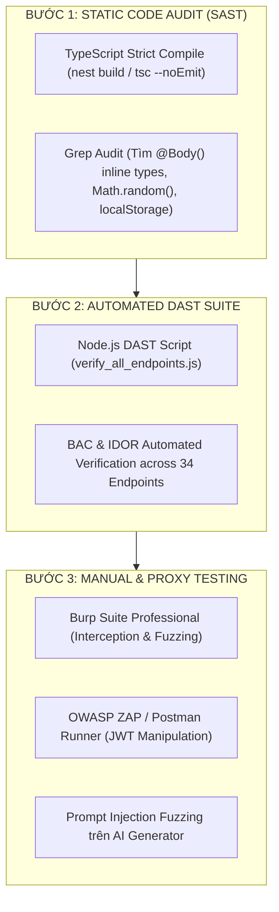

# QUY CHUẨN & HƯỚNG DẪN KIỂM THỬ AN NINH (PENTEST STANDARD & METHODOLOGY)
**Tổ chức ban hành:** URAH Network Engineering & Security Team  
**Phạm vi áp dụng:** Toàn bộ hệ sinh thái sản phẩm Web & API của URAH Network (Khách hàng & Nội bộ)  
**Phiên bản tài liệu:** 2026.1 Enterprise Edition  
**Bộ phận phụ trách:** Đội ngũ Kỹ sư An toàn Thông tin & Kiến trúc Hệ thống (SecOps & System Architects)

---

## 📖 1. TỔNG QUAN CÁC BỘ TIÊU CHUẨN QUỐC TẾ BẮT BUỘC BÁM THEO

Khi thực hiện kiểm thử xâm nhập (Pentest), rà soát mã nguồn (SAST) hoặc kiểm thử động (DAST) cho các dự án tại URAH Network, đội ngũ kỹ sư, QA và đơn vị đánh giá độc lập **BẮT BUỘC** phải tham chiếu và tuân thủ theo **4 bộ tài liệu tiêu chuẩn quốc tế** dưới đây:

### 1.1. OWASP WSTG v4.2 (Web Security Testing Guide)
- **Tổ chức ban hành:** Open Web Application Security Project (OWASP).
- **Mục đích:** Hướng dẫn phương pháp luận và kỹ thuật kiểm thử thực chiến trên 12 danh mục bảo mật ứng dụng web.
- **Tài liệu gốc tham chiếu:** [https://owasp.org/www-project-web-security-testing-guide/v42/](https://owasp.org/www-project-web-security-testing-guide/v42/)
- **12 Danh mục kiểm thử cốt lõi trong WSTG:**
  1. `WSTG-INFO` (Information Gathering): Thu thập thông tin máy chủ, công nghệ sử dụng, metadata rò rỉ.
  2. `WSTG-CONF` (Configuration & Deployment Management): Cấu hình TLS/SSL, HTTP Security Headers, Docker, CORS.
  3. `WSTG-IDNT` (Identity Management): Định danh tài khoản, đăng ký, đăng nhập, bảo vệ thông tin cá nhân.
  4. `WSTG-ATHN` (Authentication Testing): Kiểm tra JWT, Brute-force, Session Hijacking, đa yếu tố (2FA/OTP), OAuth2 (Zalo/Google).
  5. `WSTG-ATHZ` (Authorization Testing): BOLA/IDOR, leo thang đặc quyền ngang/dọc (Horizontal/Vertical Privilege Escalation).
  6. `WSTG-SESS` (Session Management): Cookie flags (`HttpOnly`, `Secure`, `SameSite`), thời gian hết hạn session, session fixation.
  7. `WSTG-INPV` (Input Validation Testing): SQL Injection, NoSQL Injection, XSS (Stored/Reflected/DOM), SSRF, Path Traversal.
  8. `WSTG-ERRH` (Error Handling): Thông báo lỗi chi tiết, rò rỉ stacktrace, mã trạng thái HTTP chuẩn.
  9. `WSTG-CRYP` (Cryptography): Độ an toàn của thuật toán mã hóa, Entropy của Token (`CSPRNG`), quản lý Secret Key.
  10. `WSTG-BUSL` (Business Logic Testing): Gian lận quy trình bán hàng POS, trùng lặp nhận quà, bypass trạng thái (State Machine Bypass).
  11. `WSTG-CLNT` (Client-side Testing): DOM XSS, rò rỉ LocalStorage, clickjacking, Web Storage security.
  12. `WSTG-APIT` (API Testing): Phân tích GraphQL/REST endpoints, mass assignment, batch querying limits.

---

### 1.2. OWASP ASVS v4.0.3 (Application Security Verification Standard)
- **Tổ chức ban hành:** OWASP Foundation.
- **Mục đích:** Khung chuẩn xác thực an ninh ứng dụng theo các cấp độ nghiêm ngặt (Level 1 $\rightarrow$ Level 3).
- **Cấp độ áp dụng khuyến nghị:** **Level 2 (Applications that contain sensitive data / Enterprise Platforms)**.
- **Tài liệu gốc tham chiếu:** [https://owasp.org/www-project-application-security-verification-standard/](https://owasp.org/www-project-application-security-verification-standard/)
- **Các chương trọng tâm:**
  - `V1` Architecture, Design and Threat Modeling.
  - `V2` Authentication Verification Standard.
  - `V3` Session Management Verification Standard.
  - `V4` Access Control Verification Standard (RBAC & IDOR defense).
  - `V5` Malicious Input Handling Verification Standard.
  - `V6` Cryptography at Rest and in Transit Standard.
  - `V13` API and Web Service Verification Standard.

---

### 1.3. OWASP API Security Top 10 (2023)
- **Tài liệu gốc tham chiếu:** [https://owasp.org/API-Security/editions/2023/en/0x11-t10/](https://owasp.org/API-Security/editions/2023/en/0x11-t10/)
- **10 Rủi ro API hàng đầu phải kiểm tra:**
  1. `API1:2023` — Broken Object Level Authorization (BOLA / IDOR).
  2. `API2:2023` — Broken Authentication (Xác thực yếu, rò rỉ JWT).
  3. `API3:2023` — Broken Object Property Level Authorization (BOPLA / Mass Assignment).
  4. `API4:2023` — Unrestricted Resource Consumption (Thiếu Rate Limit, thiếu phân trang).
  5. `API5:2023` — Broken Function Level Authorization (BFLA / Bypass quyền Admin).
  6. `API6:2023` — Unrestricted Access to Sensitive Business Flows (Bot spam quà, cào dữ liệu).
  7. `API7:2023` — Server-Side Request Forgery (SSRF trên Webhook/URL Parser).
  8. `API8:2023` — Security Misconfiguration (CORS lỏng lẻo, thiếu Security Headers).
  9. `API9:2023` — Improper Inventory Management (Shadow API, API cũ không gỡ).
  10. `API10:2023` — Unsafe Consumption of APIs (Tin tưởng dữ liệu từ bên thứ 3 không xác thực).

---

### 1.4. OWASP Top 10 for Large Language Model (LLM) Applications (2025)
- **Tài liệu gốc tham chiếu:** [https://owasp.org/www-project-top-10-for-large-language-model-applications/](https://owasp.org/www-project-top-10-for-large-language-model-applications/)
- **Các tiêu chuẩn áp dụng cho Hệ sinh thái AI Studio & Multi-Agent Applications:**
  1. `LLM01:2025` — Prompt Injection: Kẻ tấn công chèn câu lệnh ép AI vi phạm Brand Safety hoặc bộc lộ dữ liệu nhạy cảm.
  2. `LLM02:2025` — Sensitive Information Disclosure: AI sinh nội dung làm lộ thông tin cá nhân khách hàng.
  3. `LLM04:2025` — Model Denial of Service / Denial of Wallet (DoW): Đẩy tải văn bản/ảnh khổng lồ làm cạn kiệt ngân sách API Gemini/OpenAI.
  4. `LLM07:2025` — System Prompt Leakage: Người dùng yêu cầu AI in ra câu lệnh System Instruction nội bộ của doanh nghiệp.

---

## 🎯 2. MA TRẬN MAPPING TIÊU CHUẨN VÀO TỪNG MODULE ENTERPRISE APPLICATION

| Nhóm Module | Thành Phần / Endpoints Cụ Thể | Mã Tiêu Chuẩn Quốc Tế Bắt Buộc Áp Dụng | Quy Tắc Kiểm Thử & Chống Đỡ (Gold Standard) |
| :--- | :--- | :--- | :--- |
| **Xác Thực & Quản Lý Phiên (Auth & Session)** | `/auth/login`, `/auth/register`, `/auth/profile`, `/auth/sessions`, `OAuth2` | `WSTG-ATHN-01`<br>`WSTG-SESS-02`<br>`ASVS V2.1, V3.4`<br>`API2:2023` | - Cookie `HttpOnly; Secure; SameSite=Lax`.<br>- 0% lưu token trong `localStorage`.<br>- Thu hồi token khi đổi mật khẩu/đăng xuất. |
| **Khảo Sát & Ghi Ký Ức (Survey & Memory Vault)** | `/pipeline/submit/:qrId`, `/vault/save`, `/vault/delete`, `/vault` | `WSTG-ATHZ-02`<br>`ASVS V4.1, V4.2`<br>`API1:2023 (BOLA)`<br>`API3:2023` | - Lấy `userId` từ `req.user.sub`, cấm nhận `userId` từ body.<br>- Dùng Class DTO (`SaveVaultDto`, `DeleteVaultDto`) với `class-validator`. |
| **Bán Hàng POS & Niêm Phong QR (QR POS & State Machine)** | `/qr/pos/sell`, `/qr/seal`, `/qr/verify-passkey`, `/qr/claim-receiver` | `WSTG-BUSL-01`<br>`WSTG-CRYP-01`<br>`ASVS V6.2, V10.3` | - Sinh mã token bằng `crypto.randomBytes(8)` (CSPRNG).<br>- Kiểm tra nghiêm ngặt máy trạng thái (`CREATED` $\rightarrow$ `SOLD` $\rightarrow$ `SEALED`).<br>- Passkey 6 số kiểm tra brute-force rate limit (20 req/phút). |
| **AI Studio Pipeline & Xử Lý Đa Phương Tiện** | `/ai-generator/tts`, `/pipeline/status/:qrId`, `/uploads/photos` | `WSTG-INPV-11`<br>`ASVS V5.1, V12.1`<br>`API7:2023 (SSRF)`<br>`LLM01, LLM04:2025` | - Chặn SSRF tới IP nội bộ (`127.0.0.1`, `10.x.x.x`).<br>- Magic Bytes Header check cho file ảnh/video.<br>- Tách biệt `systemInstruction` và `userContent`; trần max tokens: 1000. |
| **Admin Quản Trị & Cấu Hình Hệ Thống (CMS)** | `/admin/*`, `/system-configs/*`, `/analytics/*`, `/qr-batch/*` | `WSTG-ATHZ-01`<br>`ASVS V4.3, V13.1`<br>`API4:2023`<br>`API5:2023 (BFLA)` | - RolesGuard kiểm tra quyền `super_admin`, `admin`, `branch_manager`.<br>- Phân trang bắt buộc trần `Math.min(limit, 100)`.<br>- Edge Middleware chặn role `customer` truy cập `/admin/*`. |

---

## 🛠️ 3. HƯỚNG DẪN CÔNG CỤ & QUY TRÌNH KIỂM THỬ (TESTING TOOLKIT & WORKFLOW)



### 3.1. Các Công Cụ Tiêu Chuẩn Sử Dụng Trong Dự Án:
1. **Burp Suite Professional / Community:** Bắt gói tin HTTP, giả mạo tham số (Tampering), kiểm tra IDOR, SQLi và SSRF.
2. **OWASP ZAP (Zed Attack Proxy):** Quét tự động các lỗ hổng XSS, CSP thiếu, CORS Misconfiguration.
3. **Bộ Script DAST Tự Động Nội Bộ (`scratch_verify_all_34_eps.js`):** Kiểm tra phản hồi HTTP status code của 34 endpoint cốt lõi với cả 2 trường hợp: Có Token và Không có Token.
4. **Postman / Newman:** Kiểm tra hợp đồng API (API Schema Contract) và kiểm tra các payload vi phạm DTO validation.

---

## ⚖️ 4. QUY CHUẨN TÍNH ĐIỂM RỦI RO (CVSS v3.1) & TIÊU CHÍ NGHIỆM THU

### 4.1. Ma Trận Đánh Giá Mức Độ Nghiêm Trọng (Severity Matrix):

| Mức Độ (Severity) | Điểm CVSS v3.1 | Tác Động Tiêu Biểu | Tiêu Chí Bàn Giao & Nghiệm Thu |
| :---: | :---: | :--- | :--- |
| 🔴 **CRITICAL (P0)** | **9.0 – 10.0** | Thực thi mã từ xa (RCE), Bypass xác thực toàn hệ thống, chiếm đoạt tài khoản Admin, SQL Injection khai thác được. | **BẮT BUỘC KHẮC PHỤC 100% (0 lỗi còn tồn đọng)** trước khi release. |
| 🟠 **HIGH (P1)** | **7.0 – 8.9** | IDOR xem/sửa dữ liệu người khác, SSRF trên mạng nội bộ, Mass Assignment can thiệp role admin, thiếu CSRF/CORS nghiêm trọng. | **BẮT BUỘC KHẮC PHỤC 100%** trong phiên bản bàn giao chính thức. |
| 🟡 **MEDIUM (P2)** | **4.0 – 6.9** | Thiếu Rate Limit dẫn đến spam tài nguyên, rò rỉ Stacktrace/Error message chi tiết, thiếu Security Header phụ, Session timeout quá dài. | Được lập kế hoạch xử lý trong vòng 7-14 ngày. |
| 🟢 **LOW / INFO (P3)** | **0.1 – 3.9** | Rò rỉ phiên bản phần mềm (Server banner), cấu hình cookie thiếu tối ưu nhẹ, đề xuất nâng cao UX an toàn. | Ghi nhận vào Backlog cải tiến tiếp theo. |

---

## ✅ 5. PRE-FLIGHT SECURITY CHECKLIST CHO DEVELOPER & AGENT

Trước khi hoàn thành bất kỳ tính năng mới nào hoặc nộp bản build nghiệm thu, lập trình viên/AI Agent **BẮT BUỘC** phải rà soát qua 6 tiêu chí Pre-flight sau:

```markdown
[ ] 1. Controller DTO Validation: Mọi endpoint nhận @Body() đều dùng Class DTO độc lập với decorator class-validator. Tuyệt đối không dùng body: any hoặc body: { ... }.
[ ] 2. IDOR Prevention: Mọi thao tác truy vấn/sửa/xóa tài nguyên người dùng đều lấy userId từ req.user.sub (JWT decode), cấm nhận userId từ request params/body.
[ ] 3. Token & Secret Entropy: Mọi mã token ngẫu nhiên, passkey, ID động phải dùng crypto.randomBytes(N). Cấm dùng Math.random().
[ ] 4. File I/O & SSRF Guard: Mọi đường dẫn file phải qua path.resolve và kiểm tra startsWith(baseDir). Mọi URL webhook bên ngoài phải kiểm tra chặn dải IP nội bộ.
[ ] 5. Client Security: 100% JWT lưu trong HttpOnly Cookie. 0% lưu token trong localStorage. 0% dangerouslySetInnerHTML thô.
[ ] 6. Dynamic Verification: Chạy `npm --prefix backend run build` và `npx tsc --noEmit` đạt 0 lỗi; Chạy test suite DAST đạt 100% pass.
```

---

## 🏁 6. KẾT LUẬN

Tài liệu này là **Quy chuẩn Kỹ thuật Chính thức** áp dụng bắt buộc cho toàn bộ chu kỳ phát triển dự án tại **URAH Network**. Bất kỳ module mã nguồn nào trước khi được đưa lên môi trường Production (Cloud / On-Premise) đều phải được thẩm định và đạt đủ các tiêu chí trong tài liệu này.
